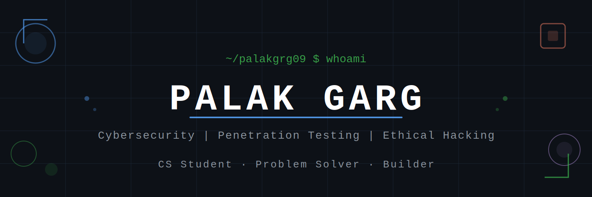

---

### Hey there! I'm **Palak Garg**
##### CS Student | Problem Solver | Builder

---

### 🧠 About Me

I'm **Palak**, a CS student who loves building things, solving problems, and exploring new technologies.

- 🚀 Passionate about writing clean, efficient code
- 🌱 Always learning something new
- 💡 Interested in turning ideas into real projects
- 🤝 Open to collaborations and interesting opportunities
- 📫 Reach me on [LinkedIn](https://linkedin.com/in/palak-garg-7b9a37284)

---

### 🚀 Featured Projects

| Project | Description | Tech |
|---|---|---|
| 🔍 [log_analyzer](https://github.com/palakgrg09/log_analyzer) | Analyzes system logs to detect anomalies and patterns | Python |
| 🌐 [network_vulnerability_scanner](https://github.com/palakgrg09/network_vulnerability_scanner) | Port scanning & risk analysis tool | Python |

---

### 🛠️ Tech Stack

---

